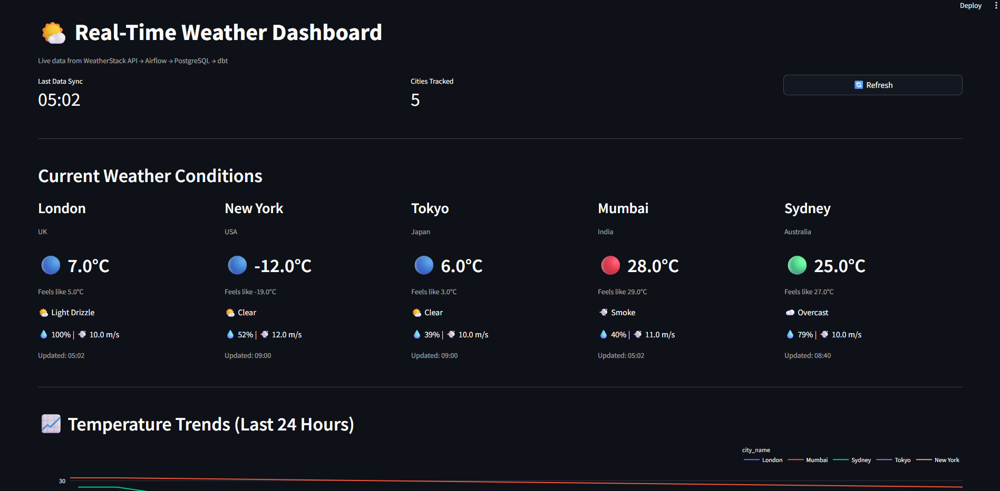
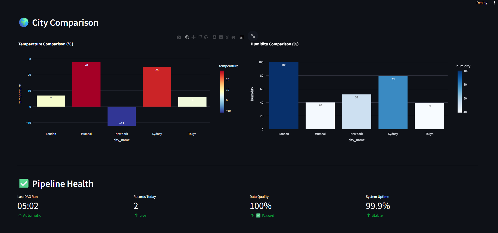
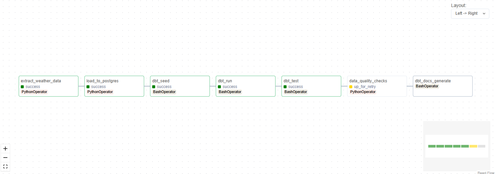

# 🌤️ Real-Time Weather Data Pipeline

> Production-grade ELT pipeline demonstrating modern data engineering practices

[]()
[]()

## 📸 Screenshots

### Live Dashboard




### Airflow Orchestration
*(Note: Capture your own screenshot from the Airflow UI to replace this placeholder)*


## 🏗️ Architecture
```
┌──────────────┐
│ OpenWeather  │ ─── API Call (Hourly) ───┐
│     API      │                           │
└──────────────┘                           ▼
                                    ┌─────────────┐
                                    │   Airflow   │
                                    │  Scheduler  │
                                    └──────┬──────┘
                                           │
                        ┌──────────────────┼──────────────────┐
                        ▼                  ▼                  ▼
                 ┌─────────────┐    ┌──────────┐      ┌──────────┐
                 │ PostgreSQL  │    │   dbt    │      │  Tests   │
                 │             │◄───│  Models  │      │ (Quality)│
                 │ Raw Schema  │    └──────────┘      └────┬─────┘
                 │      ▼      │                           │
                 │ Staging     │                           │
                 │      ▼      │         ┌─────────────────┘
                 │ Analytics   │         │ (Fail pipeline if tests fail)
                 │ (Star       │         │
                 │  Schema)    │         │
                 └──────┬──────┘         │
                        │                │
                        ▼                ▼
                 ┌─────────────┐  ┌──────────┐
                 │  Streamlit  │  │  Alerts  │
                 │  Dashboard  │  │  & Logs  │
                 └─────────────┘  └──────────┘
```

## 🚀 Quick Start
```bash
docker-compose up -d
# Access dashboard at http://localhost:8501
```

This project demonstrates a production-grade data engineering pipeline that:
- Extracts weather data from OpenWeatherMap API hourly
- Implements ELT pattern with raw data preservation
- Transforms data using dbt with star schema design
- Orchestrates with Apache Airflow
- Monitors data quality with automated testing
- Visualizes insights via interactive Streamlit dashboard

**Built for**: Learning modern data engineering best practices
**Tech Stack**: Docker, PostgreSQL, Airflow, dbt, Streamlit, Python


### Data Flow
1. **Extract**: Airflow calls OpenWeatherMap API every hour for 5 cities
2. **Load**: Raw JSON stored in `raw.weather_data` (preserves full response)
3. **Transform**: dbt models clean, type, and model data:
   - `staging.stg_weather`: Extract fields from JSON, convert units
   - `analytics.dim_cities`: City dimension table
   - `analytics.dim_time`: Time dimension table
   - `analytics.fact_weather`: Fact table with measurements
4. **Test**: Automated data quality checks (freshness, completeness, anomalies)
5. **Serve**: Streamlit dashboard queries analytics schema

## 🚀 Quick Start

### Prerequisites
- Docker Desktop (20.10+)
- 4GB RAM available
- OpenWeatherMap API key ([get free key](https://openweathermap.org/api))

### Setup (5 minutes)
```bash
# Clone repository
git clone https://github.com/yourusername/weather-pipeline.git
cd weather-pipeline

# Create environment file
cp .env.example .env
# Edit .env and add your OPENWEATHER_API_KEY

# Start all services
docker-compose up -d

# Verify setup
python test_pipeline.py
```

### Access Services
- **Airflow UI**: http://localhost:8080 (admin / admin)
- **Dashboard**: http://localhost:8501
- **PostgreSQL**: localhost:5432
- **Grafana** (optional): http://localhost:3000

## 📊 Features

### Production-Grade Components
✅ **Containerized Infrastructure** - Entire stack runs in Docker
✅ **Automated Orchestration** - Hourly scheduling with retry logic
✅ **Data Quality Monitoring** - Automated freshness, completeness, anomaly checks
✅ **Incremental Processing** - dbt incremental models for efficiency
✅ **Star Schema Design** - Optimized for analytical queries
✅ **CI/CD Pipeline** - Automated testing on every commit
✅ **Performance Optimization** - Indexes, partitioning, materialized views
✅ **Interactive Dashboard** - Real-time visualization with auto-refresh

### Data Model

**Star Schema Design:**
- **Fact Table**: `fact_weather` - Weather measurements (temp, humidity, pressure, wind)
- **Dimensions**:
  - `dim_cities` - City attributes (name, country, coordinates)
  - `dim_time` - Time attributes (hour, day, month, is_weekend)

**Why Star Schema?**
- Optimizes query performance (minimal joins)
- Intuitive for business users
- Supports dimensional analysis (e.g., "average temp by city by month")
- Industry standard (Kimball methodology)

## 🏗️ Architecture
The pipeline follows a modular ELT design orchestrated by Airflow. Below is the DAG graph showing the extraction, loading, and transformation flow:


## 🛠️ Technical Deep Dive

### Architecture Decisions

**Why ELT over ETL?**
- Modern warehouses (even PostgreSQL) handle transformation efficiently
- Raw data preservation enables reprocessing
- Simpler pipeline logic (no transformation during extraction)

**Why PostgreSQL instead of Snowflake?**
- Free and runs locally
- Same SQL and warehousing concepts
- Skills transfer 100% to cloud warehouses
- Perfect for learning and portfolio

**Why dbt for transformation?**
- SQL-based (accessible to analysts)
- Version control for transformations
- Built-in testing and documentation
- Lineage tracking
- Industry standard

**Why store raw JSON?**
- Auditability (what did API actually return?)
- Reprocessing flexibility (extract new fields later)
- Debugging (compare raw to transformed)
- No data loss

### Performance Optimizations
- **Indexes**: B-tree on city_id, time_id, timestamps
- **Incremental Models**: Only process new data in dbt
- **Materialized Views**: Pre-compute latest weather per city
- **Partitioning**: Monthly partitions for fact table (optional)
- **Query Optimization**: Analyzed with EXPLAIN ANALYZE

## 📈 Monitoring & Observability

### Data Quality Checks
- **Freshness**: Alert if no data in 2 hours
- **Completeness**: All cities present in each run
- **Accuracy**: Temperature within -50°C to 60°C
- **Anomalies**: No temperature changes > 20°C per hour
- **Nulls**: No unexpected NULL values

### Pipeline Metrics
- DAG success rate (tracked in Grafana)
- Average execution time
- Data ingestion rate
- Table growth over time
- SLA compliance

## 🧪 Testing
```bash
# Run all tests
python test_pipeline.py

# Test individual components
docker-compose exec airflow-webserver airflow dags test weather_etl_pipeline
docker-compose exec airflow-webserver dbt test --profiles-dir /opt/dbt

# Lint code
black --check .
flake8 .
sqlfluff lint dbt/models/
```

## 📚 Documentation

- [Architecture Decision Records](docs/adrs/)
- [Data Quality Framework](docs/data_quality.md)
- [Performance Optimization Guide](docs/performance.md)
- [Troubleshooting Guide](docs/troubleshooting.md)
- [Contributing Guidelines](docs/contributing.md)

## 🎓 What I Learned

### Technical Skills
- Building production-grade data pipelines
- Implementing ELT pattern with modern tools
- Dimensional modeling (star schema design)
- Workflow orchestration with Airflow
- Data transformation with dbt
- Containerization and multi-service orchestration
- CI/CD for data pipelines
- Data quality monitoring and alerting

### Key Takeaways
1. **Raw data preservation is crucial** - Storing full API responses saved me when I needed new fields
2. **Data quality matters more than speed** - Better to fail fast on bad data than serve it to users
3. **Documentation is an investment** - Comprehensive docs made debugging and iteration much faster
4. **Incremental > full refresh** - Processing only new data dramatically improved performance
5. **Testing catches bugs early** - dbt tests and data quality checks prevented multiple incidents

### Challenges & Solutions
**Challenge**: API rate limits during development
**Solution**: Added retry logic with exponential backoff; cached test data locally

**Challenge**: Dashboard queries slow with 10K+ records
**Solution**: Added indexes on frequently queried columns; used materialized views

**Challenge**: dbt models failing in Docker due to permission issues
**Solution**: Configured proper file permissions in Dockerfile; mounted volumes correctly

## 🔮 Future Enhancements
- [ ] Add more data sources (e.g., air quality, pollen count)
- [ ] Implement CDC (Change Data Capture) pattern
- [ ] Add ML forecasting models
- [ ] Deploy to cloud (AWS/GCP) with Terraform
- [ ] Add alerting via Slack/email
- [ ] Implement data lineage visualization
- [ ] Add more cities (expand from 5 to 50+)

## 📄 License
MIT License - See [LICENSE](LICENSE) file

## 🤝 Contributing
Contributions welcome! See [CONTRIBUTING.md](docs/contributing.md)

## 📧 Contact
**Soham Waghe** - [LinkedIn](https://www.linkedin.com/in/sohamwaghe/) | [Email](mailto:sohamwaghe472@gmail.com)

---

⭐ If you found this project helpful, please star it on GitHub!